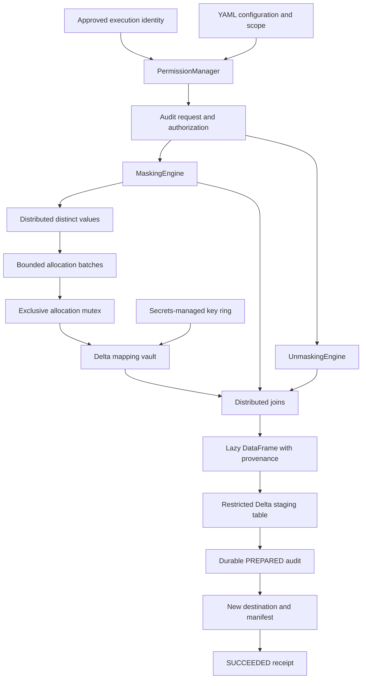

# Architecture

A scope is `(namespace, domain, mapping_version)`. It is independent of a physical
table/column name so the same email in customer and booking can share a substitute.
Exact-string equality determines source identity; no normalization is performed.
Nulls bypass allocation and remain null. Existing mapping records are authoritative.

The mapping schema contains scope, keyed fingerprint and its key ID, substitute,
encrypted original and encryption key ID, UTC creation timestamp, execution identity,
and allocation batch ID. Nonce/tag are encoded in `encrypted_original`. String is the
only supported sensitive-field type; unsupported types fail before processing.

New values stream through bounded driver batches, with Spark performing distinct
extraction and distributed mapping joins. The driver temporarily holds exact source
strings for a batch. Large vaults remain distributed in the Delta backend. Allocation
is deliberately serialized for correctness; high novel-value cardinality is a
throughput constraint to benchmark. Source data must be deterministic during a
DataFrame call. Table APIs pin the input Delta version.
Spark's `toLocalIterator` can buffer the largest partition before Python consumes
individual batches. Size distinct-value partitions appropriately; the batch size
alone is not a hard cap on all driver/JVM memory.

The built-in lookups produce realistic names/addresses and synthetic email addresses.
Pool exhaustion raises an error rather than merging source identities. Full names
use an independent reversible mapping; they are not reconstructed from first/last
name mappings, because that could lose punctuation or collapse distinct originals.
Address lines are independently mapped; coherent multi-line address tuples are not
implemented. Relationships between tables require shared domains.

The parent/child subsetting helper verifies unique non-null parent keys and rejects
orphan non-null child references before using a semi-join to select related rows.
Null child references are excluded from the chosen subset. Compose multiple edges
explicitly; automatic cyclic graph traversal is not implemented.

Table output manifests retain the logical table, full configuration/digest, per-column
scope/state, source Delta version, and request ID. Treat manifests as controlled table
metadata; the digest detects accidental configuration changes, not malicious edits
by a privileged writer. The table API verifies provenance and loads historical
configuration on restoration, avoiding accidental use of a newer mapping version.
